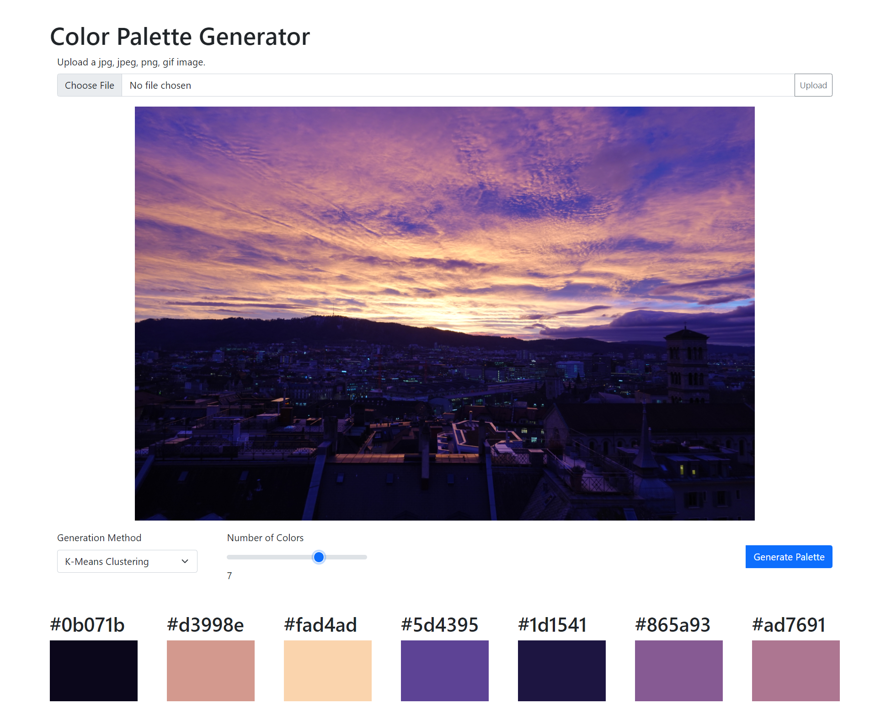
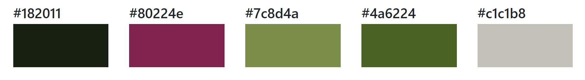
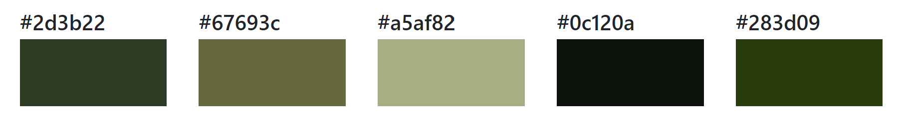
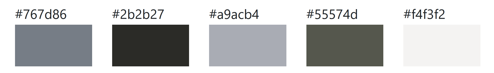
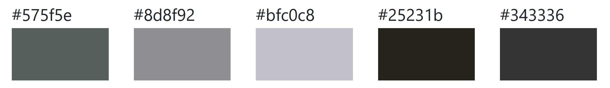
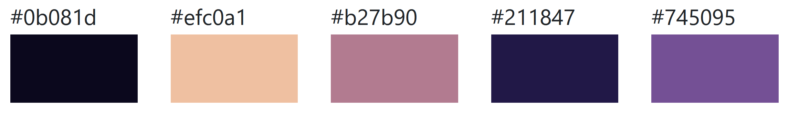
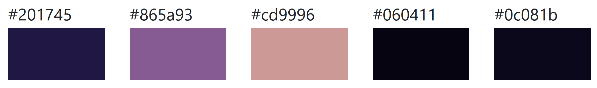

# Color Palette Generator Web Tool
An exploration of [**color quantization algorithms**](https://en.wikipedia.org/wiki/Color_quantization) implemented in a web tool for extracting color palettes from images.

## Building the Application

Backend with Python and Flask
Frontend with HTML, CSS and JavaScript
Template engine: Jinja2
Libraries: see requirements.txt

## The Algorithms
Before any of the algorithms are applied, if the provided image has higher than 720p image resolution, I first downsample the image using `cv2.resize()` with `INTER_AREA` interpolation to help speed up the palette generation.

### K-Means Clustering

Using this popular unsupervised learning algorithm, the colors of an image can be clustered and extracted. Pixels of the image are treated as points in a 3D space using its RGB values as coordinates. The user specifies how many colors to extract from the image, which is the number of clusters k. The algorithm iteratively assigns each pixel to the nearest cluster based on Euclidean distance to the centers and then updates the cluster centers to be the mean of the pixels assigned to it. When the cluster centers no longer change, the algorithm terminates and we take the final cluster centers as the colors of the palette. This is directly implemented using scikit-learn `KMeans()`.

This is a non-deterministic algorithm and is sensitive to initial cluster center placement, but by setting the random_state parameter, we can make the randomness deterministic and produce more consistent palettes.

### Median Cut

Median cut selects a representative subset of colors from an image by iteratively dividing the color space into smaller and smaller boxes by the median pixel in the highest variable dimension (i.e. cutting the largest box by half on the longest side). The iteration stops when the number of boxes reach the desired number of colors. The final colors of the palette are calculated by taking the mean of the pixels in each box.

### Octree Quantization
Submodule created using Dmitry Alimov's https://github.com/delimitry/octree_color_quantizer

An octree data structure is initialized with the root node representing the entire RGB color space, which will be split into octants. For every pixel in the image, the pixel color is added to the leaf node that it is most similar to. When a single leaf node becomes too populated, it will split into 8 child nodes each representing a portion of the color space within the parent nod. The process continues recursively until all pixels are represented by leaf nodes. The final colors of the palette are calculated by taking the mean of the pixels in each leaf node.

## Sample Results

|Image Input  | K Means | Median Cut & Octree |
| ----------- | --------| ------------------|
| |  |  |
||    |  |
||  |  |

## Future Work
- Speed up the generation and display of color palettes
- Add default sample images so that upload is not required
- Add options to export the palette as CSS, JSON, PNG
- Display additional color information, (i.e. both hex code and RGB values)
- Implement aesthetic rating and AI to suggest similar palettes

**Known Issues (TODO)**
- Error handling for invalid image uploads or missing image when clicked Generate Palette button.